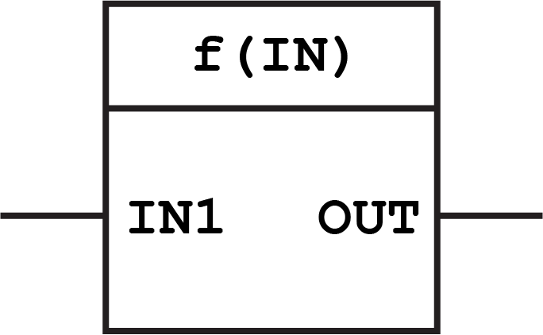
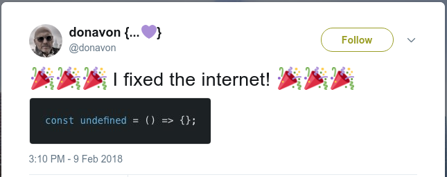

<!-- .slide: data-background="img/baby-steps.png" data-background-opacity=".4" data-background-size="contain" -->

## Functional Programming<br>baby steps<br>with JavaScript

<small>Version 0.1.0</small>

<small>by Paulo Diovani</small>

----
<!-- .slide: data-background="img/functional-programming-word-cloud.png" data-background-size="contain" -->

====
<!-- .slide: id="fp-definition" class="bigtext" -->

**Functional Programming**

is a _programming paradigm_ that

treats computation as the evaluation of mathematical functions and

avoids changing-state and mutable data

====

Mutable data

```
const zoo = [ '🐍', '🦓', '🐻', '🐕', '🦇', '🐇' ]
zoo.sort()
// [ '🐇', '🐍', '🐕', '🐻', '🦇', '🦓' ]
zoo
// [ '🐇', '🐍', '🐕', '🐻', '🦇', '🦓' ]
```

Immutable data

```
const zoo = [ '🐍', '🦓', '🐻', '🐕', '🦇', '🐇' ]
sort(zoo)
// [ '🐇', '🐍', '🐕', '🐻', '🦇', '🦓' ]
zoo
// [ '🐍', '🦓', '🐻', '🐕', '🦇', '🐇' ]
```

====

 <!-- .element: class="no-border" -->

----
<!-- .slide: id="js-definition" class="bigtext" -->

**JavaScript**

is a high-level, interpreted programming language which is also characterized

as dynamic, weakly typed, prototype-based and multi-paradigm

====

```
🔴 Uncaught TypeError: undefined is not a function
```

====

## Solving JS problems with<br>Functional Programming

 <!-- .element: class="no-border" -->

<small>https://github.com/donavon/undefined-is-a-function</small>

----

### 1. Avoid side effects

```
const family = ['👨', '👩', '👦']

function haveAnAffair() {
  family.push('👶')
}

haveAnAffair()
family
// ['👨', '👩', '👦', '👶']
```
<small>Hey, that baby isn't mine? 😕</small>

====

### ~~1. Avoid side effects~~ ✔

```
const family = ['👨', '👩', '👦']

function haveAnAffair(people) {
  people.concat('👶')
}

haveAnAffair(family)
family
// ['👨', '👩', '👦']
```

<small>A function is pure if the return value is only determined by its input values, and does not produce side effects.</small>

====

### 2. Enforce immutability

```
const myFarm = { cow: '🐄', sheep: '🐑' }

function abduct(animals) {
  animals.cow = '👽'
}

abduct(myFarm)
myFarm
// { cow: '👽', sheep: '🐑' }
```

<small>Who turned my cow into an alien? 😱</small>

====

### ~~2. Enforce immutability~~ ✔

```
const myFarm = { cow: '🐄', sheep: '🐑' }
Object.freeze(myFarm)

function abduct({...animals}) {
  animals.cow = '👽'
}

abduct(myFarm)
myFarm
// { cow: '🐄', sheep: '🐑' }
```

<small>An immutable object is an object whose state cannot be modified after it is created.</small>

----

### 3. Use map/reduce for transformations

```
const vegetables = ['🥒', '🥦', '🍅', '🥕']

function makeSalad(ingredients) {
  for (let i = 0; i < ingredients.length; i++) {
    ingredients[i] = slice(ingredients[i])
  }
  return mix(ingredients)
}

makeSalad(vegetables)
// 🥗
```

====

### ~~3. Use map/reduce for transformations~~ ✔

```
const vegetables = ['🥒', '🥦', '🍅', '🥕']

function makeSalad(ingredients) {
  return ingredients
    .map(slice)
    .reduce(mix)
}

makeSalad(vegetables)
// 🥗
```

<small>High Order Functions (HOF) are functions which takes a function as an argument and/or returns a function.</small>

====

### 4. Keep your functions short

```
function reserveRestaurantPaySendReceiptForRefund() {
  //...
}

function handleLunch() {
  //...
}
```

<small>"A function with _handle_ in the name probably does a lot of stuff." -- @silveira_bells</small>

====

### ~~4. Keep your functions short~~ ✔

```
const compose = (f1, f2, f3, f4) => (a) =>
  f1(f2(f3(f4(a))))

compose(
  waitForRefund,
  sendReceip,
  payLunch,
  reserveRestaurant
)('🍽')
```

<small>Composition is the act of putting functions together to form a function where the output of one function is the input of the other.</small>

----

### 5. Allow partial application

```
function driveUber(car, fuel, passenger) {
  return '🛣'
}

driveUber('🚙', '⛽')
// TypeError ...
driveUber(null, null, '🧑')
// TypeError ...
driveUber('🚙', '⛽', '👪')
// 🛣
```

<small>Do I need to buy a new car and fill up for each ride? 💸</small>

====

### ~~5. Allow partial application~~ ✔

```
const driveUber = (car) => (fuel) => (passenger) => {
  return '🛣'
}

const fillUp = driveUber('🚙')
// [Function]
const giveRide = fillUp('⛽')
// [Function]
giveRide('🧑')
// 🛣
giveRide('👪')
// 🛣
```

<small>Currying is the process of converting a function that takes multiple arguments into a function that takes them one at a time.</small>

====

#### ⚠ JavaScript mutator methods

`copyWithin()` `fill()` `pop()` `push()` `reverse()` `shift()` `sort()` `splice()` `unshift()`

`Object.assign()`

#### JavaScript acessor methods

`concat()` `includes()` `indexOf()` `join()` `lastIndexOf()` `slice()` `toSource()` `toString()` `toLocaleString()`

----

## JS Vanilla Syntax for ES2015 and Beyond

 <!-- .element: class="no-border no-bg half-width" -->

<small>Babel or Babel.js is a free and open-source JavaScript compiler and configurable transpiler used in web development.</small>

====

### Destructuring assignment

```
[a, b, ...rest] = ['♠', '♥', '♦', '♣'];
a // '♠'
b // '♥'
rest // ['♦', '♣']

{a, b, ...rest} = {a: '♠', b: '♥', c: '♦', d: '♣'};
a // '♠'
b // '♥'
rest // {c: '♦', d: '♣'}
```

====

### Destructuring assignment for function arguments

```
function getRedSuits({ b, c }) {
  return { b, c }
}

const suits = {a: '♠', b: '♥', c: '♦', d: '♣'}

getRedSuits(suits)
// {b: '♥', c: '♦'}
```

====

### Spread operator

```
const dateFields = [1970, 0, 1];  // 1 Jan 1970
new Date(...dateFields);

const birds = ['🕊', '🐦', '🐧'];
const rodents = ['🐀', '🐇'];
const animals = [...birds, ...rodents, '🚶']
// ['🕊', '🐦', '🐧', '🐀', '🐇', '🚶'];

const obj1 = { deepthought: '🤖', answer: 42 };
const clonedObj = { ...obj1 };
// Object { deepthought: '🤖', answer: 42 }
```

----

![avatar][avatar] <!-- .element: class="avatar" -->

### Paulo Diovani Gonçalves

Technologist in Internet Systems by Feevale University.
Software Enginer at Codeminer 42.
GNU/Linux user since 2005.
<!-- .element: class="bio" -->

<table>
  <tr>
    <td>[medium/@paulodiovani][medium]</td>
    <td>[blog.diovani.com][blog]</td></tr>
  <tr>
    <td>[slides.diovani.com][slides]</td>
    <td>[@paulodiovani][twitter]</td>
  </tr>
  <tr>
    <td colspan="2" class="align-center">
      [![codeminer42][code-logo]][code-site] <!-- .element: class="no-border no-background" -->
    </td>
  </tr>
</table>

[avatar]: img/avatar.jpg
[medium]: http://medium.com/@paulodiovani
[blog]: http://blog.diovani.com
[slides]: http://slides.diovani.com
[twitter]: http://twitter.com/paulodiovani
[code-logo]: img/codeminer42.png
[code-site]: http://codeminer42.com/
